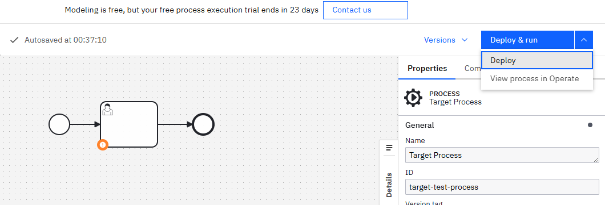
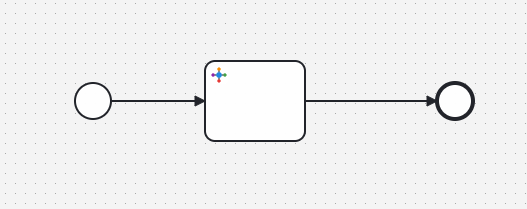
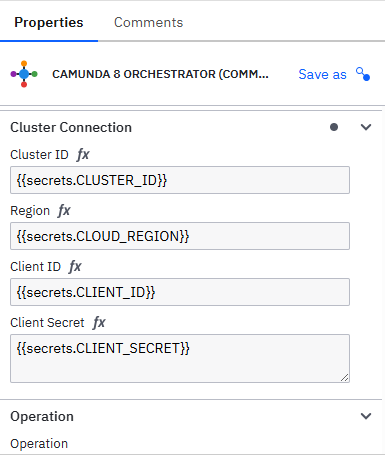
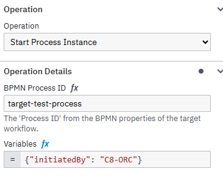
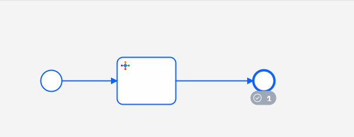
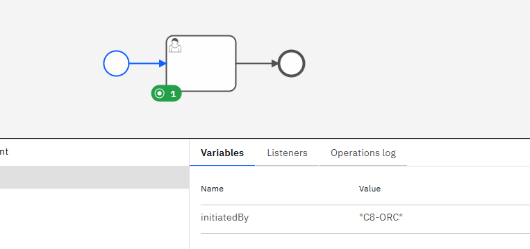

# Camunda 8 Orchestrator Connector (Community Prototype)

> [!IMPORTANT]
> **Disclaimer**: This is a **Community Prototype** and is **not an official Camunda product**. This is a project for testing. It is built for learning and experiments.

### What is this?

Usually, if you want one process to talk to another in Camunda 8, you have to write custom code. This connector will make this easy, now you can manage diagrams directly.

## Main Features

- **Start Process Instance**: Automatically start a new process by using its ID.
- **Cancel Process Instance**: Quickly stop a running process if it is no longer required.
- **Complete User Task**: Finish a task programmatically without needing a human to click a button.
- **Resolve Incident**: Fix process errors and get them moving again automatically.

---

## Example Demo

In this example we will start our 'target' process by our connector without writting java code

### Step 1: Create and Deploy a Target Process

First, make a simple process that you want to start. In this example, we use the ID "target-test-process". Make sure to click Deploy to send it to Camunda.

### Step 2: Use the Orchestrator Connector

Now create a new process, add a task and change it to the C8 Orchestrator. This task will act as the trigger to start your target process.

### Step 3: Configure Cluster Secrets

Enter your Cluster ID, Region, and API credentials. It is best practice to use secrets to keep your information safe.

### Step 4: Set the Operation Details

Choose Start Process Instance and enter the ID of the process you made in Step 1 (target-test-process). You can also send data to that process using the Variables field.

### Step 5: Run and Verify

Deploy and run your orchestrator. In Camunda Operate, you will see that the orchestrator process has finished its job successfully.

### Step 6: Confirmation

Finally, check the Target process. You will see it was started automatically by the connector, and you can even see the data we sent in the variables.

---

## How to use it in your project

1. Build: Run `mvn clean install` in your terminal to generate the connector.
2. Template: Find the JSON file in the element-templates/ folder.
3. Upload: Open Camunda Web Modeler, go to Element Templates, and upload that file.

---

## Environment Support

This connector works with both Camunda 8 SaaS (Cloud) and Self-Managed versions. Just enter your connection details and you are ready to go.

## License

This project is shared under the Apache 2.0 License.
